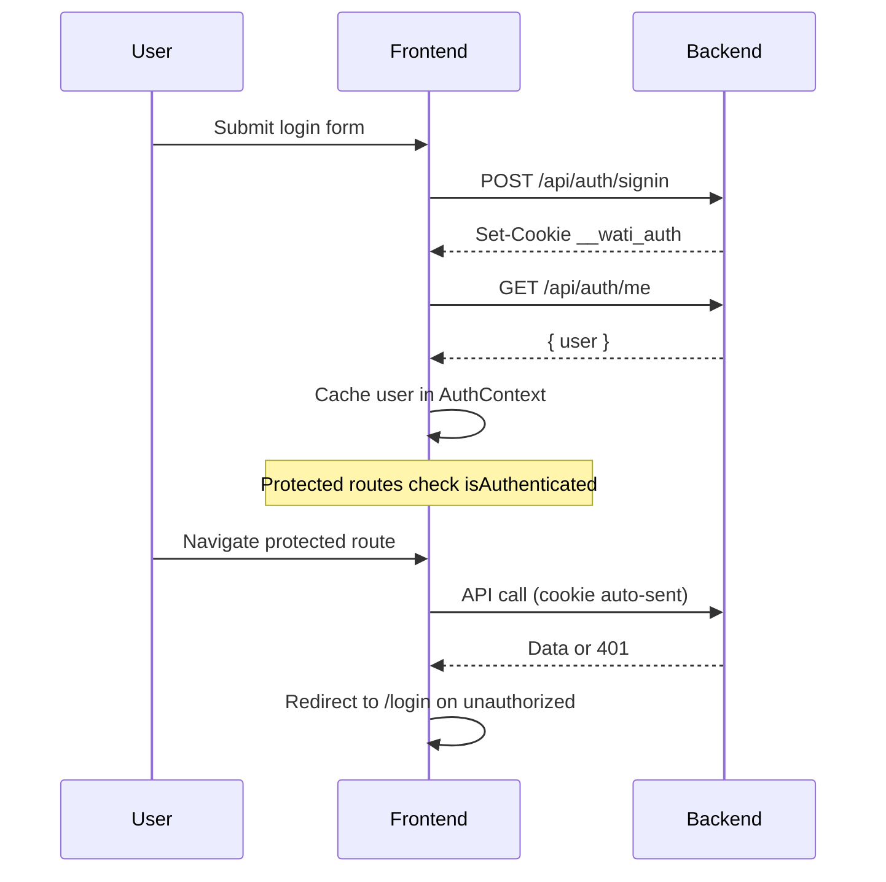

# Frontend Architecture

Production-ready React frontend for the WATI OneHub backoffice. Fully decoupled from the backend — communicates only via REST APIs.

## Tech Stack

| Layer | Technology |
|-------|------------|
| Framework | React 19 + TypeScript |
| Build | Vite 8 |
| UI | Shadcn UI + Tailwind CSS 4 |
| Routing | React Router 7 |
| Data fetching | TanStack Query 5 |
| Forms | React Hook Form + Zod 4 |
| HTTP | Axios (cookie credentials) |
| Charts | Recharts |
| Animation | Framer Motion |
| Notifications | Sonner |
| Dates | date-fns |
| Icons | Lucide React |

## Folder Structure

```
frontend/
├── docs/                    # API + architecture documentation
├── public/
├── src/
│   ├── app/                 # Static app data (dashboard samples)
│   ├── assets/
│   ├── components/
│   │   ├── shared/          # Reusable app components
│   │   └── ui/              # Shadcn primitives
│   ├── config/
│   │   ├── env.ts           # Environment configuration
│   │   └── navigation.ts    # Sidebar routes
│   ├── contexts/
│   │   ├── auth-context.tsx
│   │   └── theme-customization-context.tsx
│   ├── features/            # (reserved for feature modules)
│   ├── hooks/
│   ├── layouts/
│   │   └── app-layout.tsx
│   ├── lib/
│   │   ├── api-client.ts    # Axios + interceptors
│   │   ├── query-client.ts  # TanStack Query defaults
│   │   └── utils.ts
│   ├── pages/               # Route-level page components
│   ├── routes/
│   │   ├── index.tsx        # Route definitions
│   │   └── protected-route.tsx
│   ├── services/            # API service layer (1:1 with backend modules)
│   ├── styles/              # (index.css at src root)
│   ├── types/
│   └── main.tsx
├── .env*                    # Per-environment config
├── package.json
├── vite.config.ts
└── README.md
```

## State Management

| Concern | Solution |
|---------|----------|
| Server state | TanStack Query (`queryClient` in `lib/query-client.ts`) |
| Auth session | `AuthContext` + `/api/auth/me` query |
| Theme mode | `ThemeProvider` (next-themes pattern, localStorage) |
| Theme customization | `ThemeCustomizationContext` (CSS variables, localStorage) |
| UI state | React `useState` / component-local state |

No global Redux/Zustand — server state is the primary shared state.

## API Architecture

```
Page/Component
    ↓ useQuery / useMutation OR direct service call
Service (services/*.service.ts)
    ↓ apiGet / apiPost / apiPut / apiDelete
API Client (lib/api-client.ts)
    ↓ Axios with withCredentials: true
Backend REST API
```

### API Client Features

- **Cookie auth** — `withCredentials: true` sends `__wati_auth` automatically
- **Base URL** — `VITE_API_BASE_URL` env var; empty = Vite dev proxy
- **Retry** — Up to 2 retries on 5xx/network errors
- **Error handling** — `ApiClientError` with status + body; dispatches `auth:unauthorized` on 401
- **Typing** — Shared types in `types/api.ts` and `types/auth.ts`

## Authentication Flow



1. User signs in at `/login`
2. Backend sets HttpOnly JWT cookie (not stored in localStorage)
3. `AuthProvider` fetches `/api/auth/me` on mount
4. `ProtectedRoute` guards authenticated routes
5. Sign out calls `POST /api/auth/signout` and clears query cache

## Routing Strategy

| Route pattern | Page type |
|---------------|-----------|
| `/login` | Public auth |
| `/` | Dashboard with KPIs + charts |
| `/profile`, `/settings` | User pages |
| `/data/*` | Collection browser (paginated tables) |
| `/tools/*` | API tool forms (WABA, internal tools) |
| `/admin/*` | Admin configuration |
| `/prm-gateway`, `/affiliate`, `/partnership/*` | Module dashboards |
| `/logs` | Backoffice audit logs |

Command palette (`Cmd/Ctrl+K`) provides quick navigation to all routes.

## Component Hierarchy

```
App
└── QueryClientProvider
    └── BrowserRouter
        └── AuthProvider
            └── ThemeCustomizationProvider
                ├── PublicOnlyRoute → LoginPage
                └── ProtectedRoute
                    └── AppLayout
                        ├── AppSidebar
                        │   ├── AppSwitcher
                        │   ├── AppNavigation
                        │   └── NavUser
                        ├── SiteHeader
                        ├── Outlet (page content)
                        └── CommandPalette
```

### Reusable Components

| Component | Location | Purpose |
|-----------|----------|---------|
| `ApiToolForm` | `shared/api-tool-form` | Zod-validated API tool forms |
| `JsonViewer` | `shared/json-viewer` | API response display |
| `Pagination` | `shared/pagination` | Table pagination |
| `PageLoader` | `shared/page-loader` | Loading state |
| `EmptyState` | `shared/empty-state` | No data state |
| `ErrorState` | `shared/error-state` | Error with retry |
| `CommandPalette` | `shared/command-palette` | Keyboard navigation |
| `CollectionBrowserPage` | `pages/collection-browser` | Generic data table |

## Theme System

CSS variables in `src/index.css` define the design tokens:

- `--background`, `--foreground`, `--primary`, `--accent`, `--sidebar`, etc.
- Light/dark modes via `.dark` class on `<html>`
- User customization via `ThemeCustomizationContext`:
  - Primary color, accent color, sidebar color
  - Font family, border radius
  - Persisted to `localStorage` key `onehub-theme-customization`

Changing any variable instantly updates the entire application.

## Data Flow

### Read (Query)

```typescript
const { data, isLoading, error } = useQuery({
  queryKey: ["collection", database, collection, page],
  queryFn: () => databasesService.list(database, collection, { skip, limit }),
})
```

### Write (Mutation)

```typescript
const mutation = useMutation({
  mutationFn: (body) => wabaService.register(body),
  onSuccess: () => {
    toast.success("Done")
    queryClient.invalidateQueries({ queryKey: ["waba"] })
  },
})
```

### Forms

All tool forms use `ApiToolForm` which combines:
- React Hook Form for field state
- Zod `safeParse` for validation
- Sonner toasts for success/error feedback
- Disabled submit while processing

## Error Handling

| Layer | Behavior |
|-------|----------|
| API client | Throws `ApiClientError`; retries 5xx |
| TanStack Query | `error` state on queries; 1 retry default |
| Auth | `auth:unauthorized` event → redirect `/login` |
| UI | `ErrorState` component with retry button |
| Forms | Inline Zod validation + toast on API errors |

## Environment Configuration

| File | Purpose |
|------|---------|
| `.env` | Local defaults |
| `.env.development` | Dev deployment |
| `.env.staging` | Staging API URL |
| `.env.production` | Production API URL |

```bash
VITE_API_BASE_URL=          # Empty = use Vite proxy in dev
VITE_APP_ENV=local          # Shown in dashboard
```

Vite dev server proxies `/api` → `http://localhost:3000` (configurable via `VITE_API_PROXY_TARGET`).

## Deployment

Frontend and backend deploy independently:

1. Build: `npm run build` → `dist/`
2. Serve static files from any CDN/host
3. Set `VITE_API_BASE_URL` to backend origin at build time
4. Ensure backend CORS/cookies allow frontend origin (same-site or configured)

## Scalability Notes

- **Feature-based growth** — Add `features/<module>/` for complex modules
- **Code splitting** — Route-level lazy loading can be added via `React.lazy`
- **API services** — One file per backend module; extend without touching UI
- **RBAC UI gating** — Fetch `featureAccessControl` and gate nav items by role + permissions
